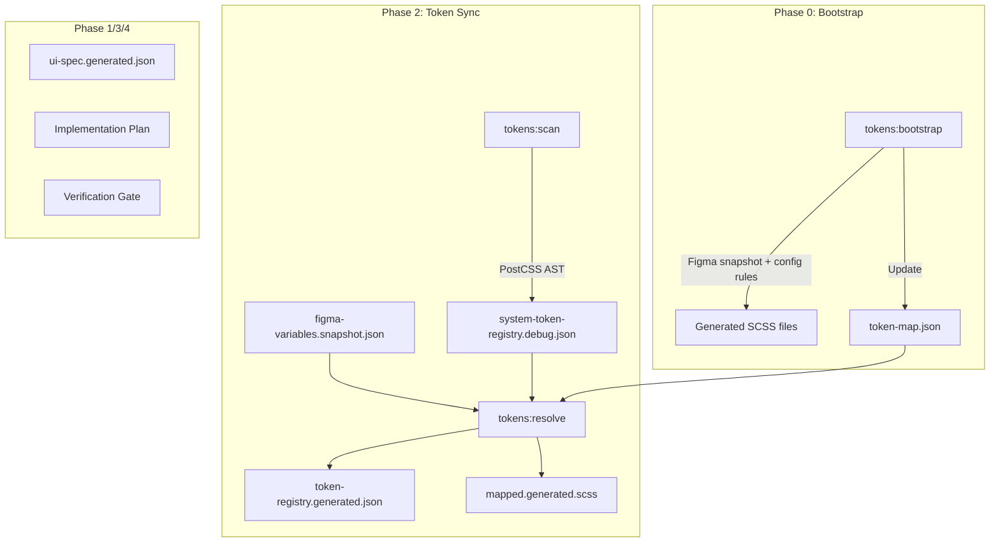

# Figma-to-Code Skill — Comprehensive Audit Report

> **Audit Date**: 2026-07-12  
> **Auditor Perspective**: Technical Architect, Senior FE Engineer, Design System Engineer, QA Engineer, Intern, Customizer  
> **Methodology**: [TEST_GUIDE.md](file:///e:/Projects/AI-Skills/TEST_GUIDE.md)

---

## 1. Executive Summary

**Readiness Level: `READY FOR INTERNAL USE`**

The skill has a solid foundation: schema-validated pipeline, deterministic outputs, idempotent sync, and comprehensive diagnostic codes. However, it has significant gaps that prevent production readiness across diverse projects.

### Three Largest Risks

1. **Bootstrap is tightly coupled to the current project's Figma naming** — regex rules in config are hand-written per project with no validation tooling, no dry-run preview of what will be matched, and no diagnostic for unmatched variables during bootstrap.
2. **No multi-mode/multi-theme support in bootstrap** — the bootstrap engine treats each mode independently but has no strategy for Figma files using real Light/Dark modes within a single collection (the most common Figma pattern). It only supports `modeSelectorMap` per rule, not per variable.
3. **`token-map.json` is fragile to rename/restructure** — the pruning logic added during bootstrap only runs during bootstrap, not during `tokens:sync`. A rename in Figma between bootstrap runs leaves stale approved mappings pointing to non-existent Figma tokens.

### Three Priorities

1. Add fixture-based tests for edge-case scenarios (S05–S13, S16–S19 from the test matrix).
2. Add bootstrap dry-run reporting (which variables matched, which were skipped, what files will be created).
3. Add validation for `token-map.json` stale entries during `tokens:sync` (not just bootstrap).

---

## 2. Current Architecture Map

### Phases

### Input/Output Table

| Phase | Input | Output | Editable? |
|---|---|---|---|
| Bootstrap | Figma snapshot + config | `styles/tokens/*.scss` + `token-map.json` | Yes (SCSS), Yes (map) |
| Scan | `styles/tokens/*.scss` | `system-token-registry.debug.json` | Never |
| Resolve | snapshot + debug registry + `token-map.json` | `token-registry.generated.json` + `mapped.generated.scss` | Never |
| Verify | All generated + codebase | Verification report | Never |

### Source of Truth

| Data | Source of Truth | Conflict Resolution |
|---|---|---|
| Design intent | Figma file | Figma wins, report VALUE_DRIFT |
| Token SCSS values | `styles/tokens/` files | Human-edited source, bootstrap re-generates |
| Mapping decisions | `token-map.json` | Human-approved, bootstrap auto-creates |
| Generated outputs | Pipeline commands | Always regenerated, never edited |

---

## 3. Assumption Registry

| # | Assumption | Status | Impact |
|---|---|---|---|
| A01 | Figma snapshot always has `schemaVersion: "1.0.0"` | **Confirmed** — validated by Ajv against schema | Low |
| A02 | All Figma variables have unique names within a collection | **Unconfirmed** — no dedup check in bootstrap or resolver for same-name variables in same collection | HIGH |
| A03 | Bootstrap rules are ordered by specificity (first match wins) | **Confirmed** — code breaks on first match, but **no documentation** of this behavior | MEDIUM |
| A04 | `token-map.json` mappings are always valid after bootstrap | **Invalid** — old mappings survive if bootstrap is not re-run after Figma changes | HIGH |
| A05 | SCSS files use `data-theme` attribute for themes | **Confirmed** — hardcoded in `inferTheme()` | MEDIUM (limits customization) |
| A06 | All CSS custom properties start with known namespaces | **Confirmed** — configurable via `tokenNamespaces` | Low |
| A07 | FLOAT values should always get `px` unit | **Invalid** — bootstrap blindly appends `px` to all FLOAT values except those containing "column". This is wrong for percentages, opacity, z-index, line-height, etc. | **BLOCKER** |
| A08 | All color values from Figma are hex or rgba strings | **Confirmed** — plugin transforms to hex/rgba | Low |
| A09 | `resolveLiteralValue()` in bootstrap will not infinite-loop | **Unconfirmed** — no cycle guard; if Figma snapshot has circular aliases, this will cause stack overflow | HIGH |
| A10 | Only one mode per collection is typical | **Needs Decision** — current project has "Mode 1" only, but real Figma designs have Light+Dark modes in a single collection | HIGH |
| A11 | Names with commas get sanitized to hyphens | **Confirmed** — recently fixed | Low |
| A12 | `_variables.scss` is always at `../styles/_variables.scss` | **Confirmed** — configurable via `tokenPaths` | Low |
| A13 | Figma plugin is available for re-export | **Confirmed** — plugin build exists | Low |
| A14 | Bootstrap generates sorted, deterministic output | **Partially confirmed** — declarations within a file are sorted by insertion order of matched rules, not alphabetically | MEDIUM |

---

## 4. Scenario Test Matrix

| ID | Scenario | Status | Result | Issues Found |
|---|---|---|---|---|
| S01 | New project, no token system | **Partially Supported** | Bootstrap generates SCSS from scratch, but requires hand-writing all regex rules | F-03, F-07 |
| S02 | Figma Variables but no code tokens | **Supported** | Bootstrap + sync works | — |
| S03 | Code tokens but no Figma Variables | **Supported** | Scan works independently; sync reports unmapped warnings | — |
| S04 | Both systems complete | **Supported** | Sync produces clean registry | VALUE_DRIFT warnings expected |
| S05 | Collection names differ from convention | **Supported** | Config `figmaCollection` is per-rule | — |
| S06 | No modes | **Not Tested** | Bootstrap requires `modeSelectorMap`; if no modes exist in snapshot, `valuesByMode` would be empty → no output generated | F-04 |
| S07 | Only Light mode | **Supported** | Config maps "Mode 1" to `:root` | — |
| S08 | Multiple theme+brand modes | **Unsupported** | Bootstrap only supports static `modeSelectorMap` per rule; cannot dynamically map Light→`:root`, Dark→`[data-theme='dark']` from a single rule | F-01 |
| S09 | Variable missing value in one mode | **Supported** | Resolver emits `THEME_MODE_MISMATCH` error | — |
| S10 | Alias missing or circular | **Partially Supported** | Resolver detects circular in Figma aliases; **BUT bootstrap's `resolveLiteralValue()` has no cycle guard** — will stack overflow | F-02 |
| S11 | Mapping has multiple candidates | **Supported** | Auto-suggestion with confidence scores; never auto-approved | — |
| S12 | Token renamed | **Unsupported** | No rename detection; old mapping becomes `MAPPING_TARGET_MISSING`, new token becomes unmapped | F-05 |
| S13 | Token deleted/deprecated | **Partially Supported** | Bootstrap prunes stale mappings; but `tokens:sync` alone does NOT prune stale `token-map.json` entries | F-06 |
| S14 | Legacy tokens in codebase | **Supported** | Preserved by design (e.g. `--alias-primay-*` typo) | — |
| S15 | Generated files manually edited | **Supported** | `tokens:check-stale` detects drift; sync overwrites | — |
| S16 | Script error mid-run | **Unsupported** | No atomic write; partial files could remain on disk | F-08 |
| S17 | Re-run script multiple times | **Supported** | Idempotent by design; integration test confirms | — |
| S18 | Monorepo | **Partially Supported** | Config supports relative paths, but `packageRootFrom()` derives root from `import.meta.url` — fragile in monorepo symlinks | F-09 |
| S19 | Large token data (1000+ variables) | **Not Tested** | No performance benchmarks; `resolveLiteralValue()` is O(N²) per alias resolution | F-10 |
| S20 | Intern follows docs alone | **Partially Supported** | Getting Started covers basic flows, but bootstrap workflow and config authoring are underdocumented | F-11 |

---

## 5. Findings

### BLOCKER

#### F-B01: Bootstrap appends `px` to ALL FLOAT values unconditionally
- **ID**: F-B01
- **Severity**: BLOCKER
- **Category**: Bootstrap logic
- **File**: [bootstrap-tokens.ts:162-172](file:///e:/Projects/AI-Skills/figma-to-code/src/bootstrap/bootstrap-tokens.ts#L162-L172)
- **Scenario**: S01, S02
- **Current behavior**: All FLOAT variables get `px` appended (except those with "column" in the name)
- **Expected behavior**: Should respect the semantic intent: opacity (0-1, no unit), z-index (unitless), line-height (unitless or ratio), percentages, etc.
- **Root cause**: Heuristic is too simplistic — only checks for "column"
- **Risk**: Generates invalid CSS values like `opacity: 0.5px` or `z-index: 10px`
- **Solution**: Add a `unitStrategy` field to bootstrap rules that can be `'px'`, `'none'`, `'%'`, or `'auto'`. Default to `'px'` for backward compatibility but allow override. Also add heuristics for common unitless properties.
- **Alternative**: Infer from variable name patterns (opacity, z-index, line-height, ratio, scale, etc.)
- **Backward compatibility**: Additive config field, existing configs unchanged
- **Verification**: Add unit test with FLOAT variables for opacity, z-index, line-height

#### F-B02: Bootstrap `resolveLiteralValue()` has no cycle guard — stack overflow risk
- **ID**: F-B02
- **Severity**: BLOCKER
- **Category**: Bootstrap logic
- **File**: [bootstrap-tokens.ts:83-99](file:///e:/Projects/AI-Skills/figma-to-code/src/bootstrap/bootstrap-tokens.ts#L83-L99)
- **Scenario**: S10
- **Current behavior**: Recursive function follows alias chains without tracking visited nodes
- **Expected behavior**: Detect cycle, return `null`, emit diagnostic
- **Root cause**: Missing `visited` Set parameter in recursive call
- **Risk**: Process crash on circular Figma aliases
- **Solution**: Add `visited: Set<string>` parameter, check before recursing
- **Backward compatibility**: None needed
- **Verification**: Add test fixture with circular alias in bootstrap context

---

### HIGH

#### F-H01: No multi-mode support in bootstrap rules
- **ID**: F-H01
- **Severity**: HIGH
- **Category**: Architecture
- **File**: [bootstrap-tokens.ts:142-145](file:///e:/Projects/AI-Skills/figma-to-code/src/bootstrap/bootstrap-tokens.ts#L142-L145)
- **Scenario**: S08
- **Current behavior**: `modeSelectorMap` is static per rule; all modes in a collection get the same file and selector
- **Expected behavior**: A single rule should be able to map multiple modes to different selectors/files (e.g., `{ "Light": ":root", "Dark": "[data-theme='dark']" }`)
- **Root cause**: Bootstrap was designed for single-mode collections
- **Solution**: `modeSelectorMap` already supports multiple keys, but the `outputFile` is per-rule. Need `modeOutputFileMap` or the ability to emit to different files per mode.
- **Risk**: Most real Figma projects use Light+Dark within semantic token collections. Without this, bootstrap cannot initialize multi-theme SCSS files correctly.

#### F-H02: `token-map.json` stale entries not detected during `tokens:sync`
- **ID**: F-H02
- **Severity**: HIGH
- **Category**: Workflow
- **File**: [resolve-tokens.ts:116-132](file:///e:/Projects/AI-Skills/figma-to-code/src/resolver/resolve-tokens.ts#L116-L132)
- **Scenario**: S12, S13
- **Current behavior**: Resolver emits `MAPPING_TARGET_MISSING` error for mappings pointing to non-existent SCSS tokens, but does NOT warn about mappings pointing to non-existent Figma tokens (line 135-143 emits a soft warning but uses `FIGMA_TOKEN_UNMAPPED_UNUSED` code which is misleading)
- **Expected behavior**: Emit `MAPPING_FIGMA_SOURCE_MISSING` or similar code when `token-map.json` references a Figma token not in the snapshot
- **Solution**: Add new diagnostic code and check in resolver; optionally auto-prune during sync with `--prune` flag

#### F-H03: No bootstrap dry-run reporting/preview
- **ID**: F-H03
- **Severity**: HIGH
- **Category**: Developer Experience
- **File**: [bootstrap-tokens.ts:14](file:///e:/Projects/AI-Skills/figma-to-code/src/bootstrap/bootstrap-tokens.ts#L14)
- **Scenario**: S01, S20
- **Current behavior**: `write: false` mode returns only `ok` and `message` with file count
- **Expected behavior**: Dry-run should return: list of matched variables, list of unmatched variables, list of files that would be created, preview of declarations per file
- **Solution**: Return a structured `BootstrapPreview` object including `matchedVariables`, `unmatchedVariables`, `filePreview`

#### F-H04: `inferTokenType()` incorrectly classifies some tokens
- **ID**: F-H04
- **Severity**: HIGH
- **Category**: Scanner logic
- **File**: [parse-scss.ts:250-297](file:///e:/Projects/AI-Skills/figma-to-code/src/scanner/parse-scss.ts#L250-L297)
- **Scenario**: S04
- **Current behavior**: `--mapped-shadow` with value `rgba(241, 245, 248, 0.5)` gets classified as `color` because the name starts with `--mapped-` which is in the color heuristic block. But semantically it's an `effect`.
- **Root cause**: Name-based heuristics at line 264 (`name.startsWith('--mapped-')`) catch all mapped tokens as colors before the shadow check on line 270-274
- **Impact**: This caused `MAPPING_TYPE_MISMATCH` errors during sync which required a manual fix to `typesCompatible()` — a bandaid, not a fix
- **Solution**: Reorder heuristics: check `shadow` keyword before broad namespace prefixes

---

### MEDIUM

#### F-M01: Theme inference is hardcoded to `data-theme`
- **File**: [parse-scss.ts:233-239](file:///e:/Projects/AI-Skills/figma-to-code/src/scanner/parse-scss.ts#L233-L239)
- **Impact**: Projects using `.dark-theme`, `[color-scheme='dark']`, or `prefers-color-scheme` media query are not detected
- **Solution**: Make theme selectors configurable in `figma-to-code.config.json`

#### F-M02: Bootstrap declarations not sorted alphabetically within selector blocks
- **File**: [bootstrap-tokens.ts:188-194](file:///e:/Projects/AI-Skills/figma-to-code/src/bootstrap/bootstrap-tokens.ts#L188-L194)
- **Impact**: Output file order depends on rule matching order and Figma collection iteration order
- **Solution**: Sort declarations by `name` before writing each selector block

#### F-M03: No `--dry-run` CLI flag for any script
- **Impact**: Users cannot preview what sync/bootstrap will do before committing
- **Solution**: Add `--dry-run` flag to sync and bootstrap CLI scripts

#### F-M04: Missing error catalog in documentation
- **Impact**: Intern cannot look up a diagnostic code and find the exact fix
- **Solution**: Extend DIAGNOSTICS.md with complete code list, add `THEME_MODE_MISMATCH`, `FIGMA_ALIAS_BROKEN`, etc.

#### F-M05: No rollback mechanism
- **Impact**: If bootstrap generates wrong files, user must manually delete and re-run
- **Solution**: Bootstrap could create a `.bootstrap-backup/` before overwriting, or at minimum document the recovery procedure

#### F-M06: `normalizeColor()` in resolver only handles hex and rgb
- **File**: [resolve-tokens.ts:309-319](file:///e:/Projects/AI-Skills/figma-to-code/src/resolver/resolve-tokens.ts#L309-L319)
- **Impact**: HSL colors, `color-mix()`, CSS named colors will false-positive VALUE_DRIFT
- **Solution**: Extend normalizer or skip drift detection for complex color functions

---

### LOW

#### F-L01: Bootstrap test coverage is minimal (1 test, dry-run only)
- **File**: [bootstrap.test.ts](file:///e:/Projects/AI-Skills/figma-to-code/tests/unit/bootstrap.test.ts)
- **Solution**: Add tests for: circular alias handling, FLOAT unit strategies, unmatched variables, multi-mode output, name sanitization edge cases

#### F-L02: No glossary in documentation
- **Impact**: Terms like "semantic token", "alias", "mapping confidence", "layer heuristic" are used without definition
- **Solution**: Add glossary section to ARCHITECTURE.md

#### F-L03: `suggestSystemToken()` partial match is overly loose
- **File**: [resolve-tokens.ts:340](file:///e:/Projects/AI-Skills/figma-to-code/src/resolver/resolve-tokens.ts#L340)
- **Impact**: `candidates.find(c => c.includes(...))` can match unrelated tokens (e.g., "primary" in "primary-text" and "primary-background")
- **Solution**: Prefer suffix match over contains match; require word boundary

#### F-L04: Scanner test assertion counts are fragile
- **File**: [scanner.test.ts:91](file:///e:/Projects/AI-Skills/figma-to-code/tests/unit/scanner.test.ts#L91)
- **Impact**: `toBeGreaterThan(80)` breaks whenever the Figma snapshot changes. Already adjusted twice.
- **Solution**: Assert structural properties (has brand tokens, has mapped tokens) instead of counts

---

## 6. Open Decisions

| # | Decision Needed | Why Important | Options | Recommendation | Required From |
|---|---|---|---|---|---|
| D01 | How should FLOAT units be determined? | Directly affects CSS output correctness | A) Infer from name heuristic B) Add `unitStrategy` to bootstrap rules C) Both | **C) Both** — heuristic as default, override per rule | Tech Lead |
| D02 | Should `tokens:sync` auto-prune stale mappings? | Affects safety vs convenience | A) Always prune B) Never prune C) `--prune` flag | **C) Flag** — safe default, opt-in convenience | Team |
| D03 | How to handle multi-mode collections in bootstrap? | Most Figma designs use Light/Dark in semantic collections | A) Separate rules per mode B) `modeOutputFileMap` in rules C) Split by convention | **B) modeOutputFileMap** | Designer + Tech Lead |
| D04 | What theme selector patterns should be supported? | Limits cross-project reuse | A) Hardcode `data-theme` B) Configurable in config | **B) Configurable** | Tech Lead |

---

## 7. Recommended Changes

### Architecture
- [ ] Add cycle guard to `resolveLiteralValue()` in bootstrap
- [ ] Add `unitStrategy` to `BootstrapRule` type
- [ ] Add `modeOutputFileMap` to `BootstrapRule` type for multi-mode support

### Workflow
- [ ] Add `--prune` flag to `tokens:sync` to remove stale mappings
- [ ] Add `--dry-run` flag to bootstrap and sync scripts with structured preview output

### Configuration
- [ ] Add `themeSelectors` config field for customizable theme detection
- [ ] Add `unitStrategy` field to bootstrap rule schema
- [ ] Validate that `modeSelectorMap` keys match actual mode names in snapshot (diagnostic if not)

### Validation
- [ ] Add `MAPPING_FIGMA_SOURCE_MISSING` diagnostic code
- [ ] Reorder `inferTokenType()` heuristics: shadow before namespace prefix
- [ ] Extend `normalizeColor()` to handle HSL and named colors

### Scripts
- [ ] Sort bootstrap output declarations alphabetically within each selector block
- [ ] Add verbose logging to bootstrap showing matched/unmatched variable summary

### Tests
- [ ] Add fixture for circular alias in bootstrap
- [ ] Add fixture for FLOAT unitless values (opacity, z-index)
- [ ] Add fixture for multi-mode collection (Light + Dark)
- [ ] Add fixture for 100+ variables (performance sanity)
- [ ] Replace count-based assertions in scanner test with structural assertions

### Documentation
- [ ] Add "Bootstrap Configuration Guide" to docs/
- [ ] Add glossary to ARCHITECTURE.md
- [ ] Complete error catalog in DIAGNOSTICS.md (all codes with examples)
- [ ] Add "Customization Guide" for new project setup
- [ ] Add rollback/recovery procedure to GETTING_STARTED.md
- [ ] Document bootstrap rule ordering behavior (first-match-wins)

### Developer Experience
- [ ] Bootstrap dry-run should print matched/unmatched variable table
- [ ] Sync should log number of stale mappings detected (even without `--prune`)

---

## 8. Documentation Gap Analysis

| Document | Status | Gaps |
|---|---|---|
| [SKILL.md](file:///e:/Projects/AI-Skills/figma-to-code/SKILL.md) | **Incomplete** | No bootstrap config guide, no explanation of bootstrap rule ordering, no troubleshooting |
| [ARCHITECTURE.md](file:///e:/Projects/AI-Skills/figma-to-code/docs/ARCHITECTURE.md) | **Incomplete** | Missing: Bootstrap module section, glossary, `BootstrapRule` type explanation |
| [GETTING_STARTED.md](file:///e:/Projects/AI-Skills/figma-to-code/docs/GETTING_STARTED.md) | **Incomplete** | Missing: bootstrap workflow, new project setup, rollback guide, config authoring |
| [DIAGNOSTICS.md](file:///e:/Projects/AI-Skills/figma-to-code/docs/DIAGNOSTICS.md) | **Incomplete** | Missing codes: `THEME_MODE_MISMATCH`, `FIGMA_MODE_MISSING`, `FIGMA_ALIAS_BROKEN`, `UNSUPPORTED_FIGMA_TYPE`, `FILE_MISSING`, `INVALID_JSON` |
| [WORKFLOW_DEEP_DIVE.md](file:///e:/Projects/AI-Skills/figma-to-code/docs/WORKFLOW_DEEP_DIVE.md) | **Good** | Missing: Bootstrap phase (Phase 0), multi-mode handling explanation |
| Customization Guide | **Missing** | How to configure for a new project with different naming, collections, modes, theme strategy |
| Migration Guide | **Missing** | How to handle token renames, collection restructures, schema version bumps |
| Error Catalog | **Incomplete** | Only 6 of 16 diagnostic codes documented |

---

## 9. Test Plan

### Unit Tests Needed

| Test | File | Priority |
|---|---|---|
| Bootstrap circular alias guard | `tests/unit/bootstrap.test.ts` | BLOCKER |
| Bootstrap FLOAT unit strategy | `tests/unit/bootstrap.test.ts` | BLOCKER |
| Bootstrap unmatched variables diagnostic | `tests/unit/bootstrap.test.ts` | HIGH |
| Bootstrap multi-mode output | `tests/unit/bootstrap.test.ts` | HIGH |
| Bootstrap name sanitization edge cases | `tests/unit/bootstrap.test.ts` | MEDIUM |
| Scanner `inferTokenType` for shadow vs mapped | `tests/unit/scanner.test.ts` | HIGH |
| Resolver stale mapping detection | `tests/unit/resolver.test.ts` | HIGH |

### Integration Tests Needed

| Test | File | Priority |
|---|---|---|
| Full bootstrap → sync → verify cycle | `tests/integration/pipeline.test.ts` | HIGH |
| Bootstrap with empty Figma collection | New fixture | MEDIUM |
| Bootstrap with 0 modes | New fixture | MEDIUM |

### Fixture Projects Needed

| Fixture | Purpose |
|---|---|
| `tests/fixtures/bootstrap-circular` | Circular alias in snapshot |
| `tests/fixtures/bootstrap-multimode` | Light + Dark modes in one collection |
| `tests/fixtures/bootstrap-unitless` | FLOAT variables: opacity, z-index, line-height |
| `tests/fixtures/bootstrap-empty` | Empty collections, no variables |
| `tests/fixtures/bootstrap-large` | 500+ variables for performance test |

---

## 10. Definition of Done

- [ ] **F-B01** fixed: FLOAT values respect unit strategy
- [ ] **F-B02** fixed: `resolveLiteralValue()` has cycle guard
- [ ] **F-H01** addressed: multi-mode bootstrap documented or implemented
- [ ] **F-H02** fixed: stale Figma token mappings detected during sync
- [ ] **F-H03** fixed: bootstrap dry-run returns structured preview
- [ ] **F-H04** fixed: `inferTokenType()` correctly classifies shadow tokens
- [ ] All existing tests pass (36/36)
- [ ] New unit tests for F-B01, F-B02, F-H04 pass
- [ ] New integration test for bootstrap→sync cycle passes
- [ ] DIAGNOSTICS.md covers all 16 diagnostic codes
- [ ] GETTING_STARTED.md includes bootstrap workflow
- [ ] ARCHITECTURE.md includes bootstrap module section
- [ ] `npm run verify:automatable` passes
- [ ] Two-run idempotency test passes
- [ ] No regression in existing fixture tests

---

## Items That Could Not Be Verified

| Item | Reason |
|---|---|
| Performance with 1000+ variables | No large fixture created yet |
| Monorepo behavior | No monorepo test environment available |
| CI environment differences | No CI pipeline configured |
| Concurrent execution safety | No concurrent test harness |
| Windows vs Unix path handling in CI | Testing only on Windows currently |
| Figma plugin re-export behavior | Requires Figma Desktop application |
| Visual pixel comparison | Requires browser automation |
