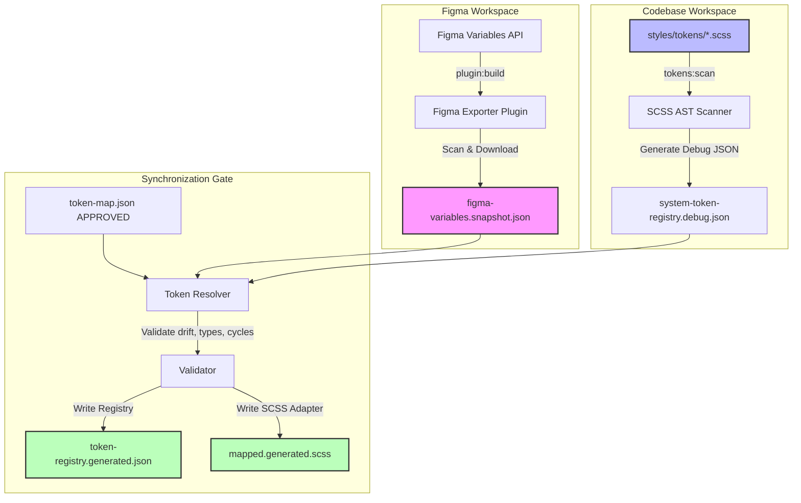

# Figma-to-Code Architecture

Tài liệu này giải thích chi tiết cấu trúc hệ thống, sơ đồ dữ liệu và vai trò của từng mô-đun trong pipeline đồng bộ hóa token thiết kế từ Figma vào SCSS.

---

## 1. Bản Đồ Thư Mục (Codebase Layout)

Thư mục chính `figma-to-code/` được chia làm các mô-đun rõ ràng theo ranh giới trách nhiệm (bounded contexts):

```text
figma-to-code/
├── schemas/               # Chứa các JSON Schemas (config, snapshot, map, registry, ui-spec)
├── plugin/                # Mã nguồn plugin Figma (build đầu ra tại dist/)
├── scripts/               # Entrypoint CLI chạy bằng node/tsx
├── src/
│   ├── contracts/         # Định nghĩa TypeScript Types và Diagnostic Codes chuẩn
│   ├── config/            # Loader cấu hình figma-to-code.config.json
│   ├── shared/            # Công cụ đọc/ghi tệp, serialize ổn định, validator schema
│   ├── scanner/           # Trình quét SCSS dựa trên PostCSS AST parser
│   ├── plugin-transform/  # Xử lý chuẩn hóa snapshot biến Figma offline
│   ├── resolver/          # Đối chiếu mapping Figma -> Code và sinh file adapter SCSS
│   ├── ui-analyzer/       # Phân tích giao diện Figma và klasify responsive (Phase 1)
│   ├── implementation/    # Lên kế hoạch tái sử dụng component và kiểm tra token (Phase 3)
│   └── verification/      # Bộ chốt chặn kiểm thử chất lượng giao diện (Phase 4)
└── tests/                 # Unit tests & Integration tests chạy bằng vitest
```

---

## 2. Sơ Đồ Luồng Dữ Liệu (Detailed Data Flow)

Hệ thống hoạt động theo cơ chế ghép nối bất đồng bộ và kiểm chứng nghiêm ngặt qua 2 pha dữ liệu đầu vào độc lập:



---

## 3. Chi Tiết Các Mô-đun Core

### A. SCSS Scanner (`src/scanner/`)
* **Thành phần:** `parse-scss.ts` và `scan-tokens.ts`.
* **Cơ chế:** Sử dụng thư viện `postcss-scss` để duyệt qua cây cú pháp AST. Nó trích xuất toàn bộ các thuộc tính bắt đầu bằng namespaces quy định (như `--brand-`, `--app-`).
* **Tính năng:**
  * Thu thập ngữ cảnh selector (`selectorContext`) như `:root` hay `[data-theme='dark']` để phân biệt theme.
  * Thu thập ngữ cảnh media rule (`responsiveContext`) để phát hiện responsive overrides.
  * Tự động lọc bỏ các biến riêng tư (tiền tố `--_`) nếu cấu hình yêu cầu.
  * Phát hiện lỗi tham chiếu đứt gãy (`TOKEN_BROKEN_REFERENCE`) hoặc vòng lặp phụ thuộc chéo (`TOKEN_CIRCULAR_REFERENCE`).

### B. Plugin Transform (`src/plugin-transform/`)
* **Thành phần:** `transform-snapshot.ts`.
* **Cơ chế:** Nhận thông tin thô từ Plugin Figma gửi ra và chuẩn hóa lại:
  * Chuyển đổi màu sắc hệ số thực `0.0 - 1.0` của Figma sang mã màu Hex hoặc `rgba(...)` tương thích CSS.
  * Lưu trữ alias dạng `{ kind: 'alias', variableId: '...' }` thay vì làm phẳng để giữ tính truy vết.
  * Sắp xếp deterministic để đảm bảo nội dung file snapshot không bị xáo trộn vị trí giữa các lần chạy.

### C. Resolver (`src/resolver/`)
* **Thành phần:** `resolve-tokens.ts`.
* **Cơ chế:** Ghép nối snapshot biến từ Figma với registry biến SCSS dựa trên file quy tắc do con người quản lý (`token-map.json`).
* **Tính năng:**
  * Chỉ duyệt các ánh xạ được đánh dấu `status: "approved"`.
  * Kiểm tra tính tương thích của kiểu dữ liệu (ví dụ: biến Figma kiểu `COLOR` không thể map sang biến SCSS kiểu `dimension`).
  * Đo sai lệch giá trị (`VALUE_DRIFT`) giữa Figma và Code và phát ra warning nhắc nhở lập trình viên.
  * Sinh ra tệp adapter `mapped.generated.scss` tự động thích ứng các biến Figma sang biến SCSS cục bộ.

---

## 4. Các Quy Tắc Thiết Kế Bắt Buộc (Invariants)
1. **Không sửa đổi thủ công file generated:** Tất cả các tệp có hậu tố `.generated.*` được quản lý bởi công cụ. Mọi thay đổi thủ công sẽ bị ghi đè khi chạy sync.
2. **Không sửa đổi giá trị SCSS canonical:** Tuyệt đối không thay đổi mã màu hoặc kích thước gốc trong `styles/` để làm các bài test của công cụ pass.
3. **Giữ nguyên chính tả token gốc:** Preserved các token có lỗi chính tả lịch sử như `--alias-primay-*` để tránh lỗi biên dịch của toàn bộ ứng dụng lớn.
